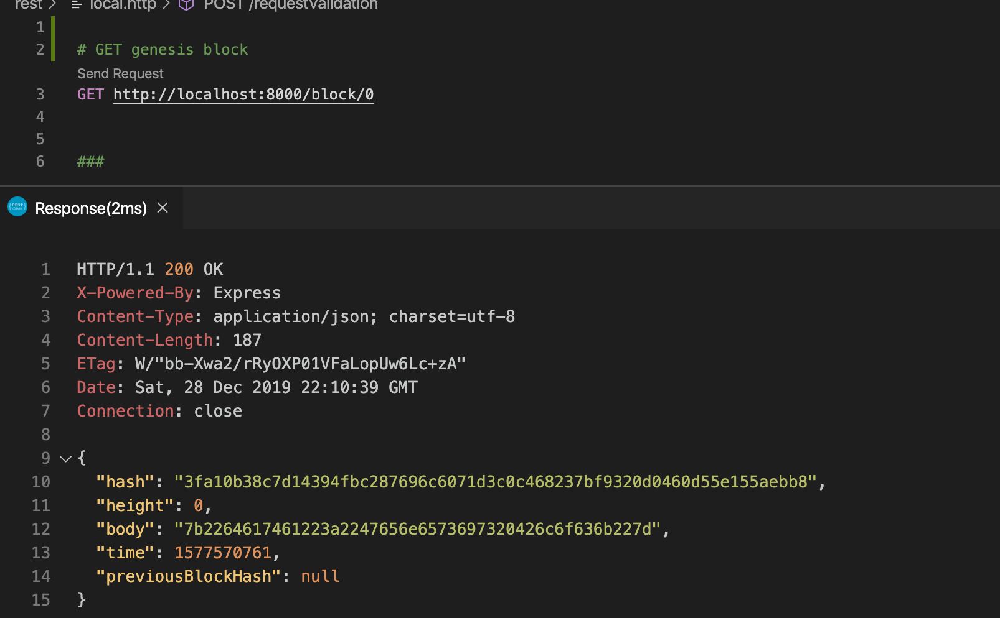
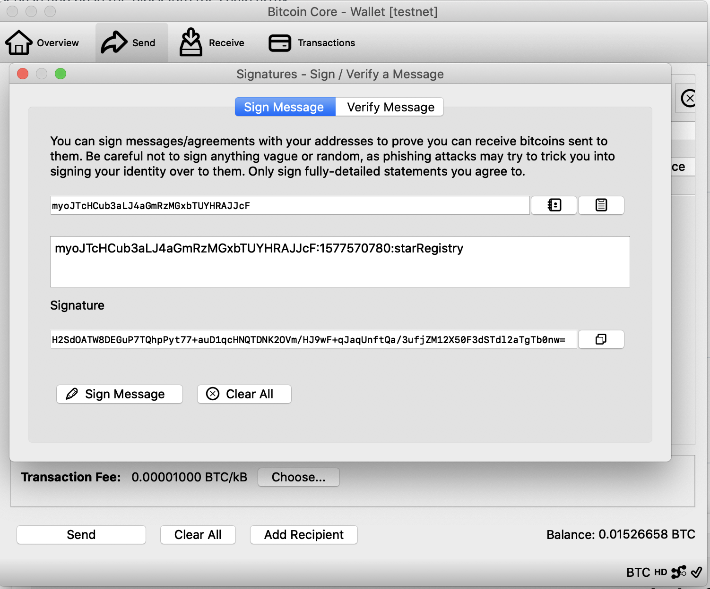
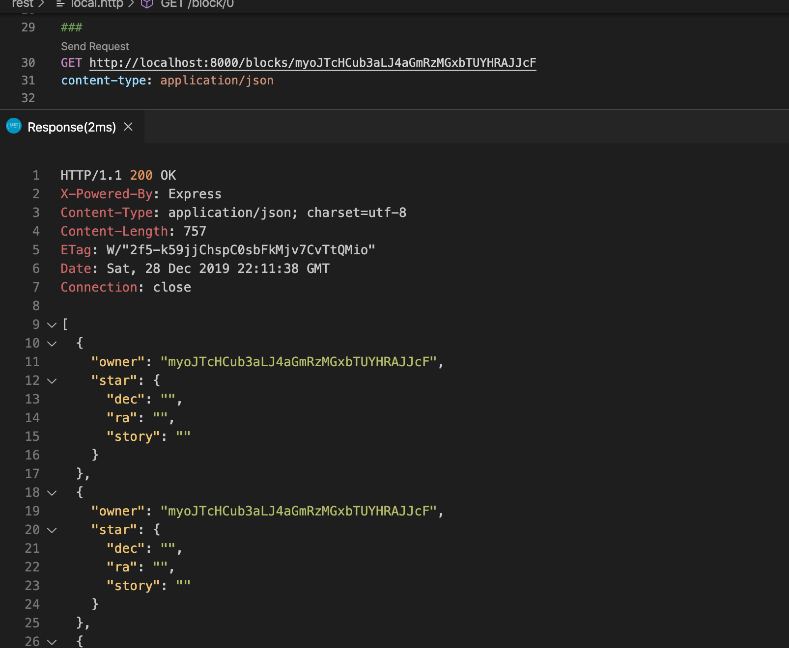

## Testing Screenshots 

Screenshot from VS Code REST Client based on REST calls from rest/local.http file.

1. must use a GET call to request the Genesis block

2. must use a POST call to requestValidation

3. must sign message with your wallet

4. must submit your Star

5. must use GET call to retrieve starts owned by a particular address

## To generate new address
 
From Bitcoin core run:

`getnewaddress "ndbd" legacy`